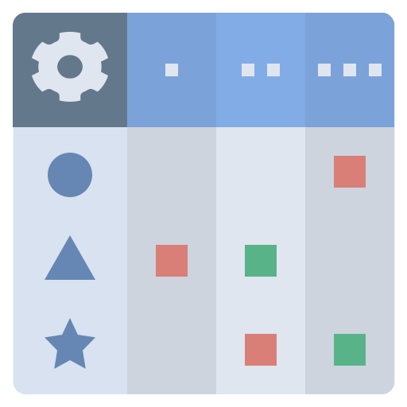
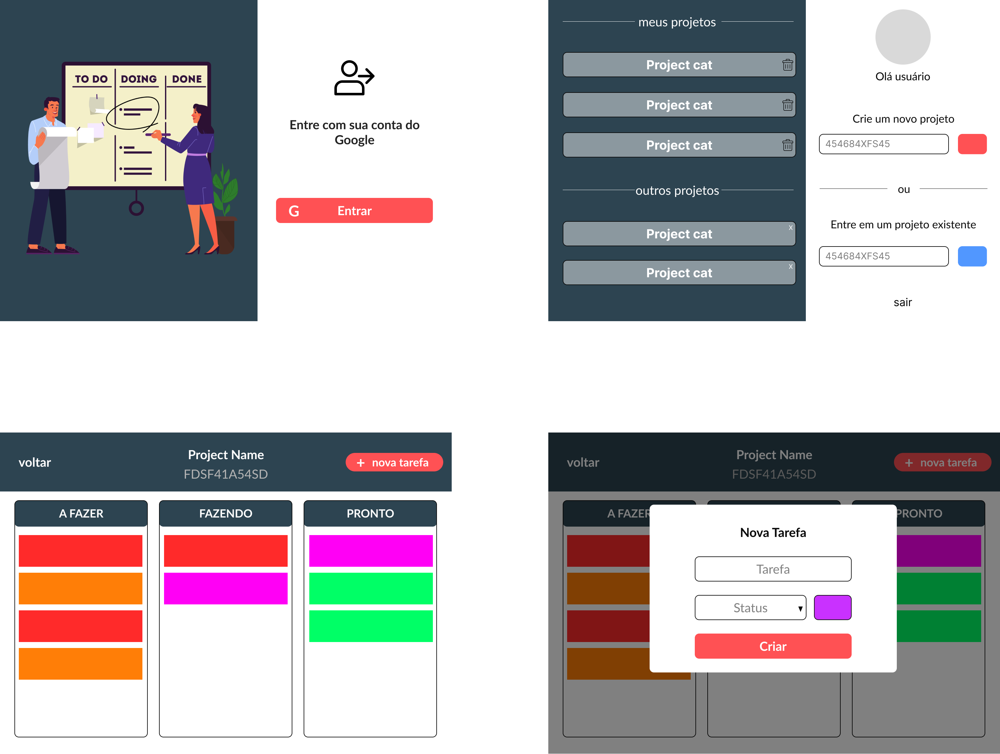

 

<h3 align="left">Kanban Board   </h3>

React kanban board app

 

###  [Figma Project][Figma-url]

 

 

 

 

###  Built With

* [![React.js][React.js]][React.js-url]

* [![Firebase][Firebase]][Firebase-url]

 

###  Link of project

* [k-board][k-board-url]

 

(<a href="#readme-top">back to top</a>)

<!-- MARKDOWN LINKS & IMAGES -->

[linkedin-shield]: https://img.shields.io/badge/-LinkedIn-black.svg?style=for-the-badge&logo=linkedin&colorB=555

[linkedin-url]: https://linkedin.com/in/karoldm

[React.js]: https://img.shields.io/badge/react-%2320232a.svg?style=for-the-badge&logo=react&logoColor=%2361DAFB

[React.js-url]: https://pt-br.reactjs.org/

[Firebase]: https://img.shields.io/badge/firebase-%23039BE5.svg?style=for-the-badge&logo=firebase

[Firebase-url]: https://firebase.com/

[Figma-url]: https://www.figma.com/file/m2hNm2c0lLfZITVRg6TaMm/kanban?node-id=0%3A1

[k-board-url]: https://kanban-97e75.web.app